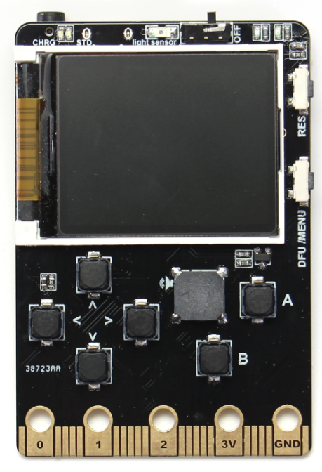

# Proceso de compilación de un port de micropython

Vamos a ver cómo podemos compilar una versión específica de micropython para otras plataformas. En este caso vamos a hacerlo para la placa [meowbit de kittenbot](https://www.kittenbot.cc/collections/frontpage/products/meowbit-codable-console-for-microsoft-makecode-arcade)



Descargamos el código de su github, que un fork (una derivación del código original de python, adaptado a este hardware)

```sh
git clone https://github.com/KittenBot/micropython_meowbit.git
```

Preparamos la compilación

```sh
cd micropython_meowbit/mpy-cross/
make
```
Descargamos los módulos de los que dependen

```sh
git submodule update --init
```


Necesitamos instalar un compilador cruzado (cross-compiler) para la CPU que vamos a usar. En mi caso para smt32, necesitamos descargar los compiladores de arm https://developer.arm.com/tools-and-software/open-source-software/developer-tools/gnu-toolchain/gnu-rm/downloads

Descomprimimos en /usr/share

```sh
sudo tar xvf ~/Descargas/gcc-arm-none-eabi-10.3-2021.10-x86_64-linux.tar.bz2 -C /usr/share/
```

Los hacemos accesibles en el Path

```sh
sudo ln -s /usr/share/gcc-arm-none-eabi-10.3-2021.10/bin/arm-none-eabi-* /usr/bin/
```

Probamos

```sh
arm-none-eabi-gcc --version
arm-none-eabi-g++ --version
```
Vamos al directorio de nuestra plataforma

```sh
cd ports/stm32/
```
y lanzamos la compilación

```
make
```

Tras unos minutos tenemos el fichero micropython.uf2 listo para subirlo a la placa.
