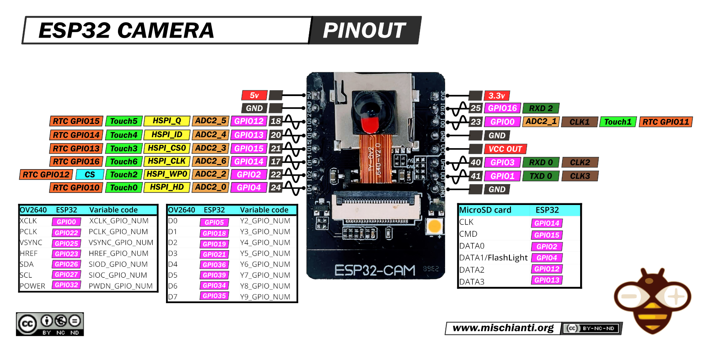

# ESP-CAM

[ESPCAM specs](https://www.mischianti.org/2021/09/02/esp32-cam-high-resolution-pinout-and-specs/)

[ESPCAM pinout](https://randomnerdtutorials.com/esp32-cam-ai-thinker-pinout/)

[ESPCAM I2C PCA9685](https://custom-build-robots.com/raspberry-pi-robot-cars/esp32-cam-building-your-own-robot-car-with-live-video-streaming-wiring-the-i%C2%B2c-hub/13578?lang=en)