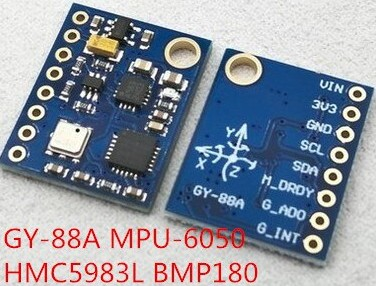

## GY-88

* Acelerómetro: MPU-6050
* Brújula (compás): HMC5983L
* Sensor atmosférico: BMP180

[Código HMC5983L](https://github.com/gvalkov/micropython-esp8266-hmc5883l)

[Código python](https://github.com/Marsfan/GY88)