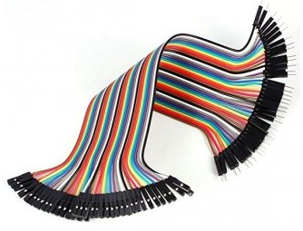
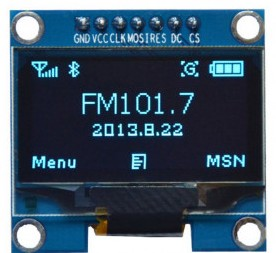

## Componentes

#### v 0.99

A lo largo del curso se usan muchos componentes en diferentes montajes, y a medida que vayamos ampliando el curso se usarán más. 

Esta lista no pretende ser exhaustivo...

### Necesarios

Son muchas las placas que podemos usar para seguir este curso, pero por su excelente relación calidad/precio, te recomiendo que si tienes que comprar una te decantes por un modelo ESP32.

Si ya dispone de algún modelo antiguo ESP8266 (Wemos o NodeMCU), también podrás realizar parte de los montajes del curso, pero te recomiendo que te compres un ESP32

A la hora de elegir entre los distintos modelos de placas ESP32, te recomiendo que leas lo siguiente:

#### ESP32 WROOM-32 DEVKIT 

El ESP32 en formato plano es el más estándar.

Tienes que tener en cuenta que al ser más ancha necesitarás al menos 2 placas de prototipo para poder conectarlo con comodidad

#### Wemos D1 R32

Si ya dispones de algunos componentes adaptados para conectar a una placa Arduino UNO (escudos/shields) te recomiendo que compres la placa Wemos D1 R32 que tiene ese formato te será más cómodo y podrá reutilizarlos sin problema

#### TT-GO T-DISPLAY ESP32 LCD

Si dispones de un poquito más de presupuesto te recomiendo la TTGO con una pantalla TFT en color, muy interesante y que nos va a dar mucho juego. Como ventaja tenemos que podemos conectarla sin problema a una protoboard y trabajar con ella.

#### ESP32 cam

Si te interesa trabajar con cámara también te recomiendo esta pequeña placa la esp32cam muy adecuada para empezar a funcionar con captura de imágenes y compatibles completamente con micropython y esp32 si es cierto que si la utiliza necesitará tendrá muy pocos pines disponibles ya que la mayoría de ellos se utilizan para la cámara y para la tarjeta

#### Otros componentes

Estos componentes son algunos de los que vamos a usar en los proyectos del curso, pero no es una lista exhaustivo

* Un par de placas protoboard
* Varios leds  + sus resistencias 220 Ohmios
* Algunos pulsadores
* Cables dupont M-M H-H
* Algunos potenciómetros de 10k o similar
* Resistencias sensibles a la luz LDR y algunas resistencias de  100k Ohmios
* Sensor de humedad de suelo o de lluvia
* Algun sensor meteorológico como bme280 ó dht22
* Pantalla LCD con conexión i2c, de al menos 2 líneas y 16 columnas (si es de 4x20 mejor)
* Pantalla Oled monocroma
* Un par de servos g90 o similares
* Al menos 1 relé
* Cable USB adecuado a tu placa

# Equipo informático

Necesitarás un ordenador conectado a internet y una conexión wifi

# ¿Dónde comprarlo?

Puedes encontrar estos materiales en casi cualquier tienda de material electrónico o amazon o aliexpress si te manejas con ellos.

Si me pides recomendación sobre una tienda donde comparlo todo, yo te recomendaría [Bricogeek](https://tienda.bricogeek.com), expertos en material electrónico que además de tener materiales de calidad te pueden ayudar en lo que necesites.

* [Placa de prototipo mediana](https://tienda.bricogeek.com/varios/1219-placa-de-prototipo-8x5cm-400-puntos.html)
* [Placa de prototipo mini](https://tienda.bricogeek.com/herramientas-de-prototipado/211-mini-breadboard-adhesiva.html)

* [Cables M-M](https://tienda.bricogeek.com/cables/1361-cables-dupont-macho-macho-20-cm-40-unidades.html)
* [Cables M-H](https://tienda.bricogeek.com/cables/1362-cables-dupont-macho-hembra-20-cm-40-unidades.html)
* [Cables H-H](https://tienda.bricogeek.com/cables/1363-cables-dupont-hembra-hembra-20-cm-40-unidades.html)

* [Kit de 37 sensores](https://tienda.bricogeek.com/kits-arduino/832-kit-de-37-sensores-compatible-arduino-1247563871496.html)

* [Miniservo](https://tienda.bricogeek.com/servomotores/1601-micro-servo-mg90-270-grados.html)

* [Pantalla OLED](https://tienda.bricogeek.com/pantallas-oled/905-pantalla-oled-13-ssh1106-128x64.html)

[Pantalla LCD con conexión I2C de 4x20](https://www.amazon.es/Display-Adapter-Raspberry-pantalla-proyecci%C3%B3n/dp/B07XT7LN61/)

[Kit de componentes básicos de electrónica](https://www.amazon.es/Componentes-Electr%C3%B3nicos-Alimentaci%C3%B3n-Potenci%C3%B3metro-Especificaciones/dp/B06Y3X9YF4)

Si quieres una placa ESP32 sencilla

[ESP32 WROOM](https://tienda.bricogeek.com/arduino-compatibles/1274-esp32-wroom-wifi-bluetooth.html)

[Cable USB](https://tienda.bricogeek.com/cables/1471-cable-usb-micro-b-corto-85cm.html)

Si quieres una placa más compleja y  **¡¡¡OJO SABES SOLDAR Y TIENES SOLDADOR!!!**

[Adafruit HUZZAH32 - ESP32 ](https://tienda.bricogeek.com/placas-adafruit-feather/1108-adafruit-huzzah32-esp32-feather.html)

