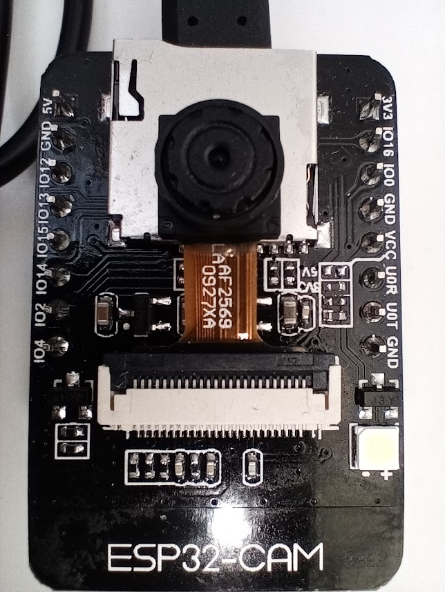

## Componentes

### Necesarios

Son muchas las placas que podemos usar para seguir este curso, pero por su excelente relación calidad/precio, te recomiendo que si tienes que comprar una te decantes por un modelo ESP32.

Si ya dispone de algún modelo antiguo ESP8266 (Wemos o NodeMCU), también podrás realizar parte de los montajes del curso, pero te recomiendo que te compres un ESP32

A la hora de elegir entre los distintos modelos de placas ESP32, te recomiendo que leas lo siguiente:

#### ESP32 WROOM-32 DEVKIT 

Si no dispones de ninguna placa de este tipo puedes comprar perfectamente la placa en formato plano pero tienes que tener en cuenta que no se conecta bien a una placa de prototipo de necesitará al menos 2 de estas placas de prototipo para poder conectar tu placa con comodidad

#### Wemos D1 R32

Si ya dispones de algunos componentes adaptados para conectar a una placa Arduino UNO (escudos/shields) te recomiendo que compres la placa Wemos D1 R32 que tiene ese formato te será más cómodo y podrá reutilizarlos sin problema

#### TT-GO T-DISPLAY ESP32 LCD

Si dispones de un poquito más de presupuesto te recomiendo la TTGO con una pantalla TFT en color, muy interesante y que nos va a dar mucho juego. Como ventaja tenemos que podemos conectarla sin problema a una protoboard y trabajar con ella.

#### ESP32 cam

Si te interesa trabajar con cámara también te recomiendo esta pequeña placa la esp32cam muy adecuada para empezar a funcionar con captura de imágenes y compatibles completamente con micropython y esp32 si es cierto que si la utiliza necesitará tendrá muy pocos pines disponibles ya que la mayoría de ellos se utilizan para la cámara y para la tarjeta

#### Otros componentes

Estos componentes son los que vamos a usar los proyectos del curso>

* Un par de placas protoboard
* Varios leds  + sus resistencias 220 Ohmios
* Algunos pulsadores
* Cables dupont M-M H-H
* Algunos potenciómetros de 10k o similar
* Resistencias sensibles a la luz LDR y algunas resistencias de  100k Ohmios
* Sensor de humedad de suelo o de lluvia
* Algun sensor meteorológico como bme280 ó dht22
* Pantalla LCD con conexión i2c, de al menos 2 líneas y 16 columnas (si es de 4x20 mejor)
* Pantalla Oled monocroma
* Un par de servos g90 o similares
* Un Joystick analógico
* Al menos 1 relé
* Motor paso a paso barato, tipo  28BYJ-48 + driver ULN2003 

# Equipo informático

Necesitarás un ordenador conectado a internet y una conexión wifi