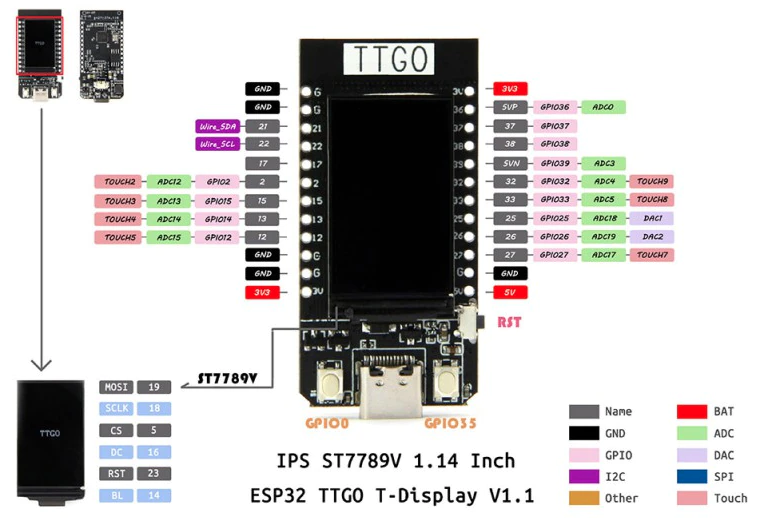

## Recursos

https://awesome-micropython.com

### Hardware

[pyboard](http://docs.micropython.org/en/latest/pyboard/quickref.html)

#### ESP32 devkit

[Detalles entre las versiones](https://www.studiopieters.nl/esp32-pinout/)

[modelo 1 ](https://descubrearduino.com/esp32-modulo-esp32-wroom-gpio-pinout/)

[Modelos de ESP32](https://www.espressif.com/en/products/modules)

### TTGO OLED color

[Producto comprado](https://es.aliexpress.com/item/4000296985840.html)

[Producto original](https://es.aliexpress.com/item/33048962331.html)

[Producto en tindie](https://www.tindie.com/products/ttgo/lilygor-ttgo-t-display-esp32-wifibluetooth-module/)

[Producto](http://www.lilygo.cn/prod_view.aspx?Id=1126)

[Esquema](https://github.com/Xinyuan-LilyGO/TTGO-T-Display/blob/master/schematic/ESP32-TFT(6-26).pdf)

QSPI flash, 4 MB
SRAM	SRAM de 520 kB

[Github](https://github.com/Xinyuan-LilyGO/TTGO-T-Display)

[firmware y detalles](https://github.com/Xinyuan-LilyGO/TTGO-T-Display)

## m5stack

### m5stack core

[m5Stack Core](https://es.aliexpress.com/item/1005001622101153.html)

[Documentación](https://docs.m5stack.com/#/en/core/basic)

### m5stick

[m5StickC](https://es.aliexpress.com/item/4000166551564.html)
 

### Raspi Pico

Puedes usar el [módulo de Fritzing de la Raspi Pico](https://datasheets.raspberrypi.org/pico/Pico-R3-Fritzing.fzpz) y [su esquema](https://datasheets.raspberrypi.org/pico/Pico-R3-A4-Pinout.pdf) de la [página de raspberry.org](https://www.raspberrypi.org/documentation/pico/getting-started/)

Más [detalles en la página de hackter.io](https://www.hackster.io/news/hands-on-with-the-rp2040-and-pico-the-first-in-house-silicon-and-microcontroller-from-raspberry-pi-effc452fc25d).

#### Instalación firmware en ESP32-CAM

[Tutorial de instalación](https://lemariva.com/blog/2022/01/micropython-upgraded-support-cameras-m5camera-esp32-cam-etc)

### micropython y micro:bit

https://microbit-micropython.readthedocs.io/en/latest/index.html

https://tech.microbit.org/software/micropython/

### PWM

[librería pwm](https://www.esploradores.com/micropython_pwm/)

### DAC

http://kio4.com/arduino/226_Wemos_DAC.htm
https://www.hackster.io/CesarSound/echotrek-digital-delay-echo-audio-effects-with-arduino-b017a2
https://www.youtube.com/watch?v=_FS4vwSLs64

https://hackaday.io/project/176774-simple-esp32-sd-audio-player-internal-dac-pdm

[Ejemplo para m5Stack](https://m5stack.hackster.io/lukasmaximus89/play-wav-files-on-your-m5stack-3bee7e)

[Ejemplo para pyBoard](https://docs.micropython.org/en/latest/pyboard/tutorial/amp_skin.html)

## ADC

[Librería ADC](https://www.esploradores.com/micropython_adc/)

### Documentación y recursos

https://github.com/pythoncanarias/upython

https://microtutorialesdc.com/course/programing/micropython

https://github.com/mytechnotalent/MicroPython-For-micro-bit

### I2C

[Listado de direcciones por fabricantes](https://learn.adafruit.com/i2c-addresses/the-list)

# Referencias

[funciones y clases](https://docs.micropython.org/en/latest/library/builtins.html