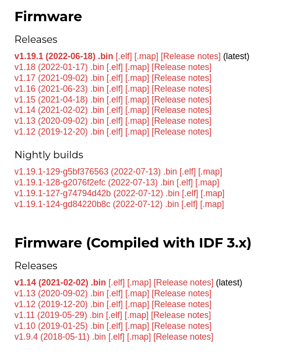

Hola, el IDF es el SDK (librerías) del fabricante. A veces cuando sacan una placa nueva solo la soporta alguna versión.
Nosostros usamos la versión 1.19.1 estable, las nightly builds son las versiones con los útlmos cambios. que van incluyendo mejoras pero a veces tienen errores,

--------------------------

Hola Marcos, el ejemplo del kernel es correcto: el firmware de micropython es un kernel que incluye librerías de acceso al hardware que funcionan como drivers de esos componentes, pero el tema del IDF no te lo he explicado en detalle.

El firmware  de micropython para ESP32 se compila con el SDK del fabricante Espressif. Este SDK  se llama idf y hay una versión 4.x y una 3.x que ya  está obsoleta, pero que en las primeros versiones de 4.0 y 4.1 donde no funcionaba el bluetooth, se seguía usando 3.x

Si no recuerdo mal en la versión 4.x se introdujeron mejoras como el soporte de ultrabajo consumo y mejor gestión de la memoria.

Por eso en las versiones antiguas de micropython (hasta 1.14) podías elegir entre una micrropython con 4.x (sin bluetooth)  pero con esas mejoras o una versión 3.x sin mejoras pero con bluetooth. En las últimas versiones 1.15 en adelante ya no se usa el IDF 3.x porque ya todo funciona bien con el 4.x

¿Y porqué mantienen los firmware antiguos, como 1.14 para descarga? Porque pudiera ser que yo tuviera  un proyecto en funcionamiento con código antiguo que funciona en 1.14 pero no "compila" en 1.19 y no quieren obligarme a tener que cambiarlo. 

Incluir imagen esquemática de qué es micropython

IDF + python + modulos

¿y el micropython de m5stack?

