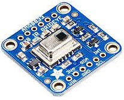

# AMG8833 Cámara térmica

[Ejemplo micropython](https://github.com/bkircher67/Simple-Micropython-Class-for-Controlling-AMG8833-8x8-Pixel-Grid-Eye-)

[Librería adafruit](https://learn.adafruit.com/adafruit-amg8833-8x8-thermal-camera-sensor/python-circuitpython)

[Ejemplo raspberry](https://learn.adafruit.com/adafruit-amg8833-8x8-thermal-camera-sensor/raspberry-pi-thermal-camera)