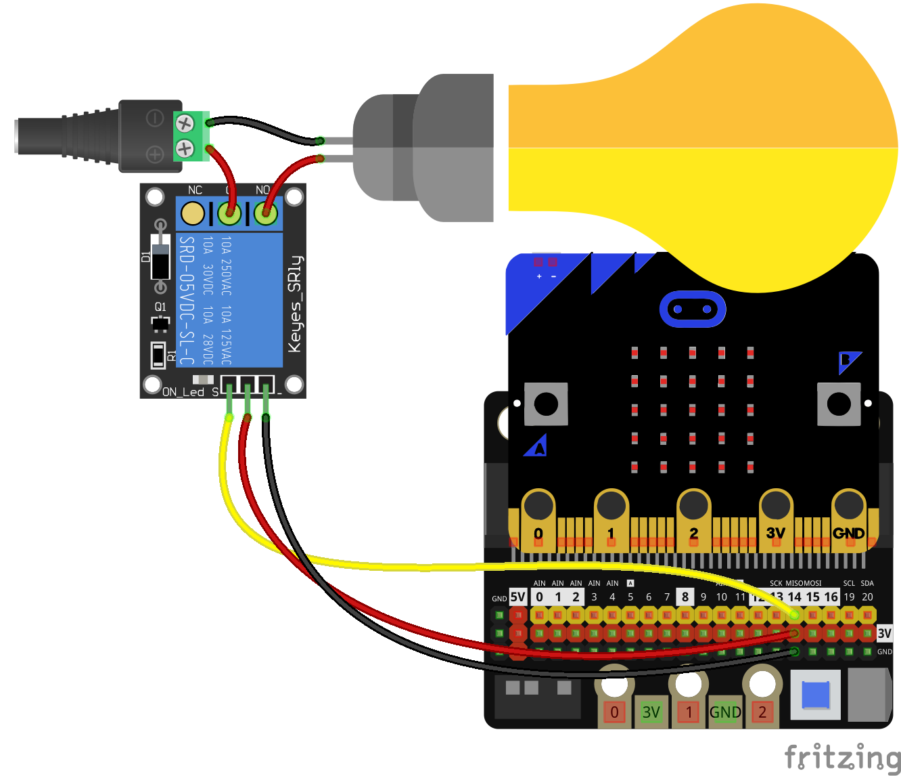

# micropython en micro:bit

En la micro:bit v1 anda muy justito....

Uso del editor online

Si queremos conectar un relé lo haríamos de la misma manera:

### referencias

[editor python beta](https://python.microbit.org/v/beta)

[documentación v2](https://microbit-micropython.readthedocs.io/en/v2-docs/)

[documentación microptyhon para micro:bit](https://microbit-micropython.readthedocs.io/en/latest/)

[MicroPython en micro:bit](https://tech.microbit.org/software/micropython/)

[guía del usuario para micro:bit](https://microbit.org/get-started/user-guide/python/)

[codigo micropython 2.0 para micro:bit](https://github.com/microbit-foundation/micropython-microbit-v2)

[firmware firmware 2.0]([repositorio de Micropython para micro:bit](https://github.com/microbit-foundation/micropython-microbit-v2/releases/download/v2.0.0/micropython-microbit-v2.0.0.hex))

[ejemplos micropython 1.0 para micro:bit](https://github.com/bbcmicrobit/micropython/tree/master/examples)

[firmware micropython 1.0 para micro:bit](https://github.com/bbcmicrobit/micropython/releases/download/v1.0.1/microbit-micropython-v1.0.1.hex)

[código micropython 1.0 para micro:bit](https://github.com/bbcmicrobit/micropython)

[ejemplos micropython elefreaks](https://www.elecfreaks.com/learn-en/microbitKit/ring_bit_v2/ring-bit-python.html)

### 2 digit

[github](https://github.com/javacasm/display-2-cifras-display/blob/master/main.ts)

[proyecto makecode](https://makecode.microbit.org/_dTpd7aTam9KW)
