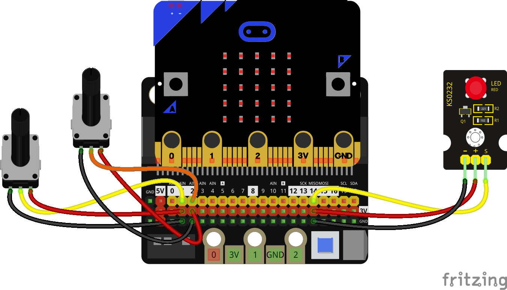

## Estroboscopio con micro:bit

Un estroboscopio es un dispositivo que produce iluminación de tipo flash y del que podemos controlar la frecuencia de este parpadeo. Si aplicamos esta luz sobre un objeto en movimiento, ajustando la frecuencia del parpadeo a

```python
from microbit import *
from utime import sleep_ms, sleep_us, ticks_us

duracion = 100
while True:
    espera = pin2.read_analog()*200
    pin14.write_digital(True)
    sleep_us(duracion)
    # print(ticks_us())
    pin14.write_digital(False)
    sleep_us(espera)

```

Añadimos animación con Images.ALL_CLOCKS

## Definimos una función




```python
# Estroboscopio con frecuencia y duración de flash controlada por 2 potenciometros

from microbit import *
from utime import sleep_ms, sleep_us, ticks_us

def estroboscopio(pinLed = pin14, pinPotRetardo = pin2, pinPotDuracion = pin1, factorRetardo = 200, factorDuracion = 10 ):

    contandor = 0
    contadorMax = len(Image.ALL_CLOCKS)
    
    while True:
        espera = pinPotRetardo.read_analog() * factorRetardo
        pinLed.write_digital(True)
        display.show(Image.ALL_CLOCKS[contandor])
        duracion = pinPotDuracion.read_analog()* factorDuracion
        sleep_us(duracion)
        # print(ticks_us())
        pinLed.write_digital(False)
        sleep_us(espera-duracion)
        contandor = (contandor + 1) % contadorMax

estroboscopio()     
```
