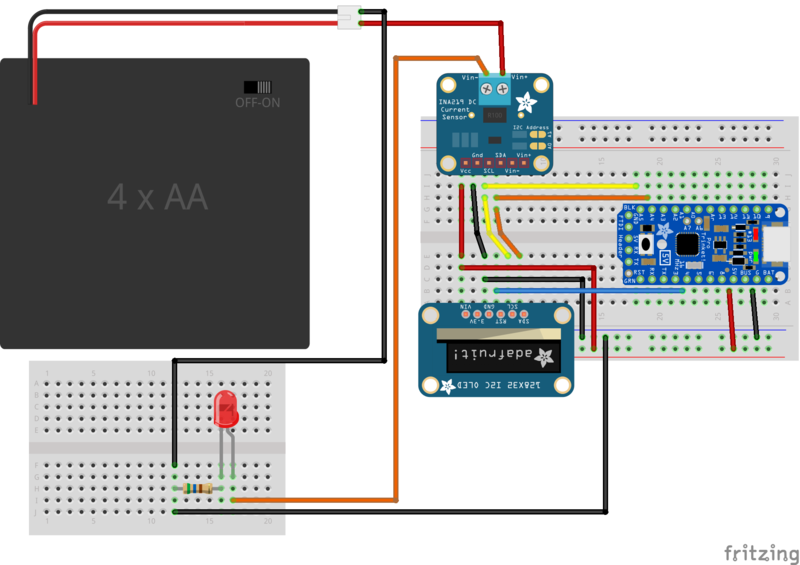
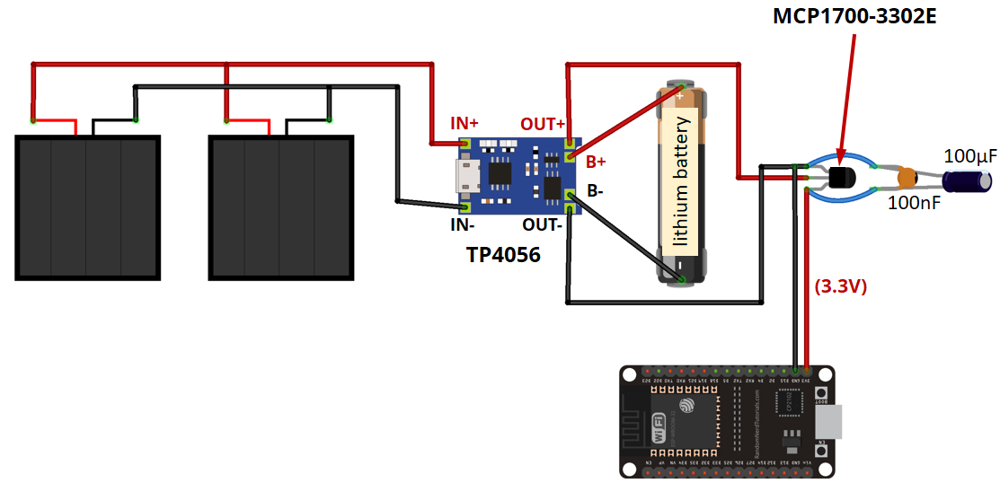

## Power by solar

[Cargador solar MPPT](https://learn.sparkfun.com/tutorials/sunny-buddy-solar-charger-v13-hookup-guide-?_ga=2.244673605.172413037.1653381196-1624138858.1644789111)

Usaremos sensores INA219 para medir el voltaje de cada elemento y la corriente

[Tutorial adafruit INA219](https://learn.adafruit.com/portable-solar-charging-tracker?view=all)

[Referncia INA219](https://learn.adafruit.com/adafruit-ina219-current-sensor-breakout?view=all)

[medidor INA219](https://learn.adafruit.com/pro-trinket-power-meter?view=all)

[Alimenta ESP32 desde LIPO](https://randomnerdtutorials.com/power-esp32-esp8266-solar-panels-battery-level-monitoring/)

