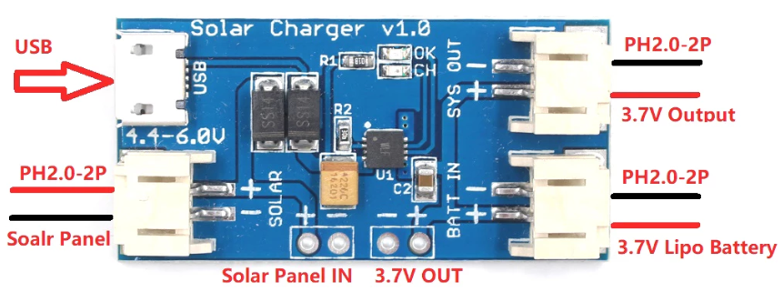

## Cargador solar

Usamos un [Cargador solar MPPT](https://learn.sparkfun.com/tutorials/sunny-buddy-solar-charger-v13-hookup-guide-?_ga=2.244673605.172413037.1653381196-1624138858.1644789111), el Sunny Buddy de Sparkfun que se [conecta así](https://learn.sparkfun.com/tutorials/sunny-buddy-solar-charger-v13-hookup-guide-)

Usaremos sensores INA219 para medir el voltaje de cada elemento y la corriente

Vamos a monitorizar el voltaje del panel, de la batería y de la carga que conectemos, midiendo el voltaje y la corriente que pasa a cada uno de ellos

[Tutorial adafruit INA219](https://learn.adafruit.com/portable-solar-charging-tracker?view=all)

[Referencia INA219](https://learn.adafruit.com/adafruit-ina219-current-sensor-breakout?view=all)

[medidor INA219](https://learn.adafruit.com/pro-trinket-power-meter?view=all)

[Librería micropython](https://github.com/chrisb2/pyb_ina219)

## Alimentación desde Lipo

Algunas placas disponen de cargador y de conexión con batería.

Siempre podemos [alimentar el ESP32 desde LIPO](https://randomnerdtutorials.com/power-esp32-esp8266-solar-panels-battery-level-monitoring/)

### Otros cargadores

tp4056

Importante que tenga protección para la lipo

CN3065

