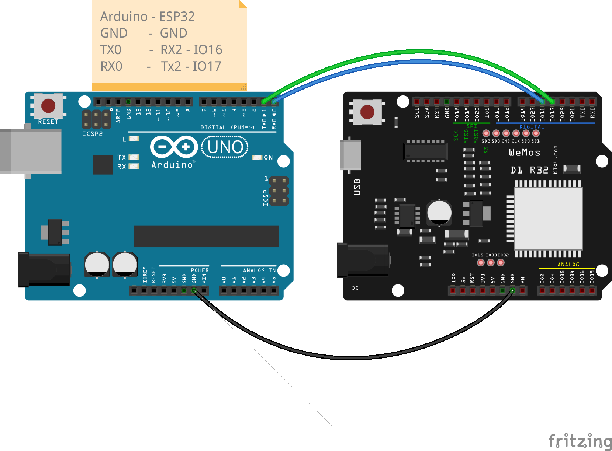

## Comunicaciones serie entre dispositivos

uart 


uart2 = UART(2, baudrate=9600, tx=17, rx=16)

uart.read(10)       # read 10 characters, returns a bytes object
uart.read()         # read all available characters
uart.readline()     # read a line
uart.readinto(buf)  # read and store into the given buffer
uart.write('abc')   # write the 3 characters


UART.any()¶




```python
from machine import UART
from time import ticks_ms, sleep_ms


v = 0.4

uart2 = UART(2, baudrate=9600, tx=17, rx=16)

def sendCommand(command):
    print(f'> command({command})')
    uart2.write(command)
    
def phisicalPixelMaster(delay_ms = 30):
    
    while True:
        sendCommand('H')
        sleep_ms(delay_ms)
        sendCommand('L')
        sleep_ms(delay_ms)
        
physicalpixel_comands = ['H', 'L']
def sendCommands(comands, retardo_ms=500):
    last_time_command = ticks_ms()
    counter = 0
    while True:
        now = ticks_ms()
        if now - last_time_command > retardo_ms:
            sendCommand(comands[counter%len(comands)])
            counter += 1
            last_time_command = now
        while uart2.any()>0: # hay datos
            line = uart2.readline().decode('UTF-8').replace('\r\n','')
            print(f'< "{line}"')

def echoSerial():
    while True:
        c =uart0.read()
        uart0.write(c)
        print('< {c}\necho > {c}')


```

```C++
const int ledPin = 13; // the pin that the LED is attached to

void setup() {
  // initialize serial communication:
  Serial.begin(9600);
  // initialize the LED pin as an output:
  pinMode(ledPin, OUTPUT);
}
long last_mesg = millis();
void loop() {
  // see if there's incoming serial data:
  if (Serial.available() > 0) {
    // read the oldest byte in the serial buffer:
    int incomingByte = Serial.read();
    // if it's a capital H (ASCII 72), turn on the LED:
    switch (incomingByte ) {
     case 10: // fin de linea, no hacemos nada
      break;
     case 'H':
      digitalWrite(ledPin, HIGH);
      Serial.println("Led On");
      break;
     case 'L':
      digitalWrite(ledPin, LOW);
      Serial.println("Led Off");
      break;
     case 'T':
      Serial.print(last_mesg);
      Serial.print(' ');
      Serial.println(millis());
      break;
     default:
      Serial.print(incomingByte);
      Serial.println(" comando desconocido");
      break;
    }
      
  }
  long now = millis();
  if (now - last_mesg >= 2000) {
    Serial.println(now);
    last_mesg = now;
  }
}
```


UART.irq(trigger, priority=1, handler=None, wake=machine.IDLE)¶
Create a callback to be triggered when data is received on the UART.

trigger can only be UART.RX_ANY

priority level of the interrupt. Can take values in the range 1-7. Higher values represent higher priorities.

handler an optional function to be called when new characters arrive.

wake can only be machine.IDLE.


